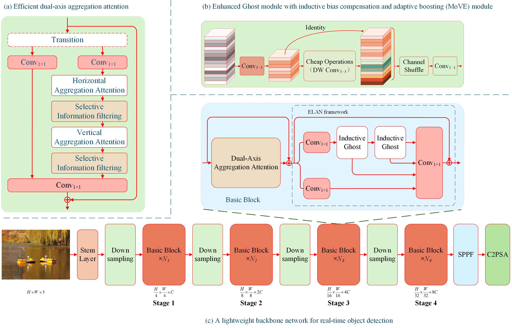

# DA<sup>3</sup>Net: Dual-Axis Aggregation Attention Network for Efficient Object Detection

This project is built based on [Ultralytics](https://github.com/ultralytics/ultralytics).

Self-attention has demonstrated great potential for improving performance in object detection. However, the quadratic computational complexity with respect to the input size hinders its feasibility for high-resolution vision tasks in real-time scenarios. To effectively address this issue, we reinterpret self-attention as selective global context aggregation and propose a Dual-Axis Aggregation Attention (DA<sup>3</sup>) module. It achieves global perception with linear complexity by sequentially aggregating features along the distinct spatial axes, followed by depth-wise separable convolution to enhance feature selection. Based on this mechanism, we develop DA<sup>3</sup>Net, a lightweight backbone for efficient object detection. It also incorporates an enhanced local feature extraction module to improve the representation learning of fine-grained visual details guided by inductive bias compensation, which is an essential complement to long-range dependencies.

Extensive experiments validate the effectiveness of the proposed approach. On MS COCO, DA<sup>3</sup>Net-N achieves 41.7 AP, exceeding YOLO11-N by 2.2 AP. Ablation studies on the PASCAL VOC further demonstrate the effectiveness and efficiency of each design component, with DA<sup>3</sup>Net-N attaining 63.17 mAP, which is 2.4 mAP higher than YOLO11-N. On a RTX A5000 GPU, it runs at 420.63 FPS in TensorRT format—over 12x faster than standard self-attention—demonstrating strong real-time capability. Moreover, generalization experiments on underwater object detection further validate the robustness and adaptability of the proposed approach.



## Results
| **Method**               | **Param.(M)** | **FLOPs(G)** | **AP<sub>50:95</sub>** | **AP<sub>50</sub>** | **AP<sub>75</sub>** |
|--------------------------|---------------|--------------|------------------------|---------------------|---------------------|
| YOLOv6-3.0-N             | 4.7           | 11.4         | 37.0                   | 52.7                | -                   |
| Gold-YOLO-N              | 5.6           | 12.1         | 39.9                   | 56.0                | 43.3                |
| YOLOv8-N                 | 3.2           | 8.7          | 37.7                   | 52.5                | 40.6                |
| YOLOv10-N                | 2.3           | 6.7          | 38.5                   | 63.7                | 61.6                |
| YOLO11                   | 2.6           | 6.5          | 39.5                   | 55.1                | 42.8                |
| **DA<sup>3</sup>Net-N**  | **2.6**       | **6.9**      | **41.7**               | **58.2**            | **44.9**            |

| **Method**               | **Param.(M)** | **FLOPs(G)** | **AP<sub>50:95</sub>** | **AP<sub>50</sub>** | **AP<sub>75</sub>** |
|--------------------------|---------------|--------------|------------------------|---------------------|---------------------|
| YOLOv6-3.0-S             | 18.5          | 45.3         | 44.3                   | 61.2                | -                   |
| Gold-YOLO-S              | 21.5          | 46.0         | 45.4                   | 63.5                | 50.4                |
| YOLO-MS-XS               | 4.5           | 17.4         | 43.4                   | 60.4                | 47.6                |
| YOLO-MS-S                | 8.1           | 31.2         | 46.2                   | 63.7                | 50.5                |
| YOLOv8-S                 | 11.2          | 28.6         | 45.0                   | 61.8                | 48.7                |
| YOLOv9-S                 | 7.1           | 26.4         | 46.7                   | 63.4                | 50.7                |
| RT-DETR-R18              | 20.0          | 60.0         | 46.5                   | 63.8                | -                   |
| YOLOv10-S                | 7.2           | 21.6         | 46.3                   | 62.9                | 50.2                |
| YOLO11-S                 | 9.5           | 21.7         | 46.9                   | 63.8                | 50.7                |
| **DA<sup>3</sup>Net-S**  | **9.5**       | **22.8**     | **48.5**               | **65.6**            | **52.7**            |

| **Method**               | **Param.(M)** | **FLOPs(G)** | **AP<sub>50:95</sub>** | **AP<sub>50</sub>** | **AP<sub>75</sub>** |
|--------------------------|---------------|--------------|------------------------|---------------------|---------------------|
| YOLOv6-3.0-M             | 34.9          | 85.8         | 49.1                   | 66.1                | -                   |
| Gold-YOLO-M              | 51.3          | 87.5         | 49.8                   | 67.0                | -                   |
| YOLOv8-M                 | 25.9          | 78.9         | 50.3                   | 67.2                | 54.7                |
| RT-DETR-R34              | 36.0          | 100.0        | 48.9                   | 66.8                | -                   |
| RT-DETRv2-R34            | 36.0          | 100.0        | 49.9                   | 67.5                | -                   |
| YOLOv9-M                 | 20.0          | 76.3         | 51.4                   | 68.1                | 56.1                |
| YOLOv10-M                | 15.4          | 59.1         | 51.1                   | 68.1                | 55.8                |
| YOLO11-M                 | 20.1          | 68.0         | 51.5                   | 68.5                | 55.7                |
| **DA<sup>3</sup>Net-M**  | **18.3**      | **68.8**     | **52.3**               | **69.7**            | **57.0**            |

| **Method**               | **Param.(M)** | **FLOPs(G)** | **AP<sub>50:95</sub>** | **AP<sub>50</sub>** | **AP<sub>75</sub>** |
|--------------------------|---------------|--------------|------------------------|---------------------|---------------------|
| YOLOv6-3.0-L             | 59.6          | 150.7        | 51.8                   | 69.2                | -                   |
| Gold-YOLO-L              | 75.1          | 151.7        | 51.8                   | 68.9                | -                   |
| YOLOv8-L                 | 43.7          | 165.2        | 53.0                   | 69.8                | 57.7                |
| RT-DETR-R50              | 42.0          | 136.0        | 53.1                   | 71.3                | -                   |
| RT-DETRv2-R50            | 42.0          | 136.0        | 53.4                   | 71.6                | -                   |
| YOLOv9-C                 | 25.3          | 102.1        | 53.0                   | 70.2                | 57.8                |
| YOLOv10-B                | 19.1          | 92.0         | 52.5                   | 69.6                | 57.2                |
| YOLOv10-L                | 24.4          | 120.3        | 53.2                   | 70.1                | 58.1                |
| YOLO11-L                 | 25.3          | 86.9         | 53.3                   | 70.1                | 58.2                |
| **DA<sup>3</sup>Net-L**  | **27.7**      | **106.9**    | **53.9**               | **70.6**            | **58.6**            |

| **Method**               | **Param.(M)** | **FLOPs(G)** | **AP<sub>50:95</sub>** | **AP<sub>50</sub>** | **AP<sub>75</sub>** |
|--------------------------|---------------|--------------|------------------------|---------------------|---------------------|
| YOLOv8-X                 | 68.2          | 257.8        | 54                     | 71                  | 58.8                |
| RT-DETR-R101             | 76            | 259          | 54.3                   | 72.7                | -                   |
| RT-DETRv2-R101           | 76            | 259          | 54.3                   | 72.8                | -                   |
| YOLOv10-X                | 29.5          | 160.4        | 54.4                   | 71.3                | 59.3                |
| YOLO11-X                 | 56.9          | 194.9        | 54.6                   | 71.6                | 59.5                |
| **DA<sup>3</sup>Net-X**  | **61.7**      | **234.8**    | ****                   | ****                | ****                |

## Training

```python

from ultralytics import YOLO


# Load a model
model = YOLO("yolo113n.yaml") # yolo113 is the alias of DA3Net

# Train the model
train_results = model.train(
    data="coco.yaml",
    epochs=500,  # number of training epochs
    batch=128,
    imgsz=640,  # training image size
    scale=0.5,  # N:0.5, S:0.9; M:0.9; L:0.9; X:0.9
    mosaic=1.0,
    mixup=0.0,  # N:0.0, S:0.05; M:0.15; L:0.15; X:0.2
    copy_paste=0.1,  # N:0.1, S:0.15; M:0.4; L:0.5; X:0.6
    device=[0, 1],  # device to run on, i.e. device=0 or device=0,1,2,3 or device=cpu
    project="runs/yolo113_coco",
    name="113n"
)

```

## Validation
```python
from ultralytics import YOLO

model = YOLO('runs/yolo113_coco/113n/weights/best.pt')
print(model)
model.info()


metrics = model.val(data='coco.yaml', batch=1)

print("mAP50-95:", metrics.box.map)  # mAP50-95
print("mAP50:", metrics.box.map50)  # mAP50
print("mAP75:",metrics.box.map75)  # mAP75
print("list of mAP50-95 for each category:", metrics.box.maps)  # list of mAP50-95 for each category
```

## Citation

If you find this project useful in your research, please consider cite:

```
Coming soon
```